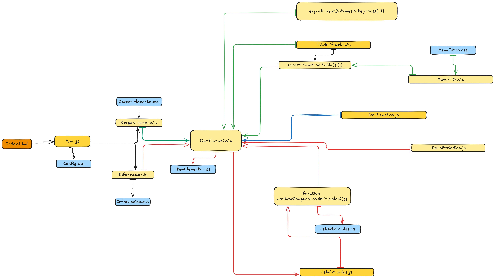

# Tabla Periodica

## Autor:
 Emanuel Ordoñéz

## Establecimiento: 
Colegio Santa Catalina Laboure

## Link de la pagina:
https://rockemma.github.io/tabla-periodica-estuardo/

## Descripcion del proyecto

### Breve resumen de lo que realiza tu aplicación web

La aplicación web proporciona informacion sobre la tabla periodica de sus 118 elementos, y las caracteristicas que lo componenen a cada uno de los elementos, proporciona formulas para resolver ejercicios.

### Propósito y problema que resuelve

El proposito del esta aplicacion web, es dar a conocer de una forma interactiva y facil de entender la tabla periodica y las formulas que se pueden hacer con estas.

### Público objetivo
El publico objetivo para esta aplicacion serian los estudiantes de bachillerato. 

## (Sistema de Carpetas) construcción:

.
├── componentes/
│   ├── componentes/
│   │   └── itemElemento/
│   │       ├── itemElementos.js
│   │       └── itemElemento.css
|   |
│   ├── footer/
│   │   ├── footer.css
│   │   └── footer.js
|   |
│   ├── header/
│   │   ├── header.js
│   │   └── header.css
|   |
│   └── tablaPeriodica/
│       ├── tablaperiodica.css
│       └── tablaperiodica.js
|   
├── data/
│   └── DbElementos.js
|
├── utils/
│   ├── iconos/
│   └── img/
|
├── config.css
├── index.html
├── main.js
└── README.md

## Instalacion y forma de uso:
Esta apliacion Web, no necesita de ninguna instalacion ya que esta se
ejecuta desde cualquier navegador, no necesita de ningun inicio de secion para guardar datos, ya que estos se quedan guardados en el navegador.

La forma de utilzar la Web: Darle click al elemento que quieres te saldra una tabla con los elemntos que proporciona la pagina, y la parte inferior escoges que decesas hacer y introduces los datos que uno decea. 

## Puntos a tomar en cuenta para Contribuir de una forma correcta:

### 1. Cuando hagas el commit escribe claro y conciso la descripción clara de la nueva funcionalidad o cambio

### 1.1 Formato de commit:

feat: Para nuevas características o funcionalidades.

fix: Para corrección de errores.

docs: Para cambios en la documentación.

style: Para cambios de estilo (formato, sangrías, etc.).

refactor: Para refactorización del código sin cambios en la funcionalidad.

test: Para agregar o corregir pruebas.

### 3. Desde tu repositorio en GitHub, abre un Pull Request repositorio original. Asegúrate de incluir una descripción detallada de los cambios que has hecho y el propósito de los mismos.

### 4. Tu Pull Request será revisado y discutido si es necesario. Si se necesitan cambios adicionales, te lo harán saber para que puedas ajustarlos antes de la aprobación final.

## Licencia:
Este proyecto esta registrado con la licencia de MIT License

### MIT License: 
Es una de las licencias más permisivas. Permite que otros usen, copien, modifiquen y distribuyan el software incluso para fines comerciales, con la única condición de que se mantenga una copia de la licencia original con el código.

## Contacto, Portafolio: 
https://eeordonezz.github.io/mi_portafolio2024-Student-/